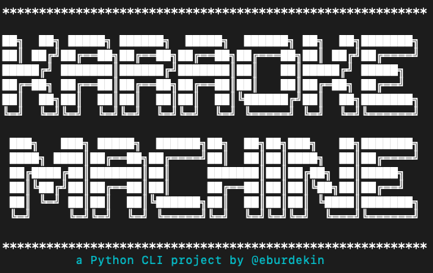

# Karaoke Machine

a Python CLI project by Eileen Burdekin

## Overview

Welcome to your very own CLI Karaoke Machine. Just pick a song to get started.

## Installation

Requirements

- Python 3.8.13
- SQLite 3

Installation Steps

- Enter `pipenv install && pipenv shell`
- Enter `python lib/cli.py`

## Features

- SQLite database to store Your Playlist and Song Library
- CLI menu built with Typer functionality & Rich styling
- Scrolling lyrics via Rich Live Display
- Backup instrumentals load via YouTube using YouTube Data API v3
